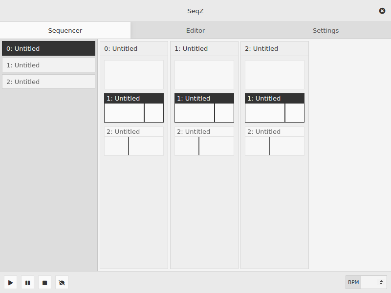

# seqzero-ui

*The project is in a very early stage of developement, it's not working yet and pretty much anything including the name is subject to change.*

**IDEAS**

- a seq24/sequencer64 alternative
- for the live: no song mode
- no MIDI, only OSC
- using [seqzero](https://github.com/jean-emmanuel/seqzero) as engine
- using electron to build the interface but with a headless mode
- for linux !

